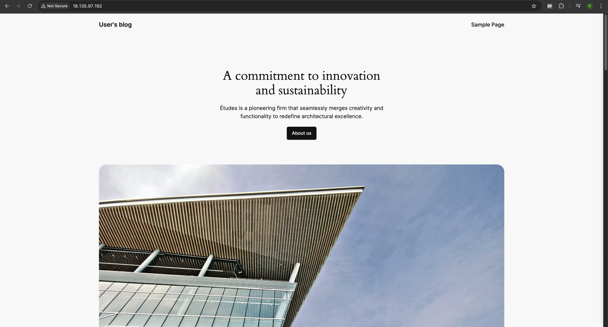

# AWS Infrastructure Setup for WordPress using Terraform

This document provides a breakdown of the Terraform configuration files required to set up a basic AWS infrastructure for running a WordPress application.

## Overview

The project includes the following AWS resources:

1. **VPC (Virtual Private Cloud)**: A virtual network for isolating resources.
2. **Subnet**: A public subnet to launch instances in.
3. **Internet Gateway**: To allow instances in the public subnet to access the internet.
4. **Security Group**: To control access to the WordPress instance.
5. **EC2 Instance**: A WordPress application running on an EC2 instance.
6. **Route Table**: To route traffic between the internet and resources in the VPC.

## Structure

The configuration is organized in three parts:

1. **VPC Module**
2. **EC2 Module**
3. **Main Configuration**

---

## 1. VPC Module Configuration

The `vpc` module creates the Virtual Private Cloud (VPC) and associated resources.

### Resources:

- **aws_vpc**: Creates the VPC with a CIDR block.
- **aws_subnet**: Creates a public subnet in the VPC.
- **aws_internet_gateway**: Establishes an internet gateway for internet access.
- **aws_route_table**: Configures a route table for the public subnet.
- **aws_route_table_association**: Associates the route table with the public subnet.

### Code:

```hcl
resource "aws_vpc" "vpc" {
  cidr_block = var.vpc_cidr
}

resource "aws_subnet" "public_subnet" {
  vpc_id = aws_vpc.vpc.id
  cidr_block = var.public_subnet_cidr
  availability_zone = "eu-west-2a"
  map_public_ip_on_launch = true
}

resource "aws_internet_gateway" "igw" {
  vpc_id = aws_vpc.vpc.id
}

resource "aws_route_table" "public_route_table" {
  vpc_id = aws_vpc.vpc.id

  route {
    cidr_block = var.cidr_block
    gateway_id = aws_internet_gateway.igw.id
  }

  tags = {
    Name = "Public"
  }
}

resource "aws_route_table_association" "public_route_assoc" {
  subnet_id = aws_subnet.public_subnet.id
  route_table_id = aws_route_table.public_route_table.id
}
```

### Purpose:

- **VPC**: Defines a network for your AWS resources with a CIDR block.
- **Public Subnet**: A subnet that is accessible from the internet.
- **Internet Gateway**: Provides internet access to resources in the public subnet.
- **Route Table**: Ensures that traffic from the public subnet can access the internet through the gateway.

---

## 2. EC2 Module Configuration

The `ec2` module provisions an EC2 instance that will run WordPress. It configures the instance's security group, access key, and AMI.

### Resources:

- **aws_security_group**: Creates a security group allowing traffic on HTTP (port 80).
- **aws_key_pair**: Fetches an existing key pair for SSH access to the instance.
- **aws_ami**: Selects the AMI for WordPress (Bitnami WordPress in this case).
- **aws_instance**: Creates the EC2 instance using the selected AMI and instance type.

### Code:

````
```hcl
resource "aws_security_group" "wordpress_sg" {
  name        = "wordpress_sg"
  description = "Allow web and SSH traffic"
  vpc_id      = var.vpc_id

  ingress {
    from_port   = 80
    to_port     = 80
    protocol    = "tcp"
    cidr_blocks = var.allowed_cidr_blocks
  }

  egress {
    from_port   = 0
    to_port     = 0
    protocol    = "-1"
    cidr_blocks = var.allowed_cidr_blocks
  }
}

data "aws_key_pair" "key" {
  key_name = "wordpress-key"
}

data "aws_ami" "wordpress" {
  filter {
    name   = "name"
    values = ["bitnami-wordpresspro-6.5.3-5-r05-linux-debian-12-x86_64-hvm-ebs-nami"]
  }
  filter {
    name   = "root-device-type"
    values = ["ebs"]
  }
  filter {
    name   = "virtualization-type"
    values = ["hvm"]
  }
}

resource "aws_instance" "wordpress" {
  ami                    = "${data.aws_ami.wordpress.id}"
  instance_type          = var.instance_type
  subnet_id              = var.subnet_id
  vpc_security_group_ids = [aws_security_group.wordpress_sg.id]
  key_name               = data.aws_key_pair.key.key_name
}

````

### Purpose:

- **Security Group**: Allows HTTP (port 80) traffic to the WordPress EC2 instance.
- **Key Pair**: Provides SSH access to the instance for management.
- **AMI**: Specifies the Bitnami WordPress AMI for launching the EC2 instance.
- **EC2 Instance**: The WordPress instance that is launched in the specified VPC and subnet.

---

## 3. Main Configuration

The `main.tf` file ties together the VPC and EC2 modules and passes the necessary variables.

### Code:

```hcl
module "vpc" {
  source             = "./modules/vpc"
  vpc_cidr           = var.vpc_cidr
  public_subnet_cidr = var.public_subnet_cidr
  cidr_block         = var.cidr_block
}

module "ec2" {
  source      = "./modules/ec2"
  vpc_id      = module.vpc.vpc_id
  subnet_id   = module.vpc.subnet_id
  instance_type = var.instance_type
}
```

### Purpose:

- The `main.tf` file initializes the `vpc` and `ec2` modules and passes the required variables for creating the VPC, subnet, and EC2 instance.
- It ensures the EC2 instance is launched in the subnet created by the `vpc` module.

---

## Conclusion

By running this Terraform configuration, you will set up a simple infrastructure in AWS that includes:

- A VPC with a public subnet.
- An EC2 instance running WordPress.
- Security group configurations for web traffic (HTTP) and SSH access.

This setup is ideal for deploying a basic WordPress website using a Bitnami image on AWS.


