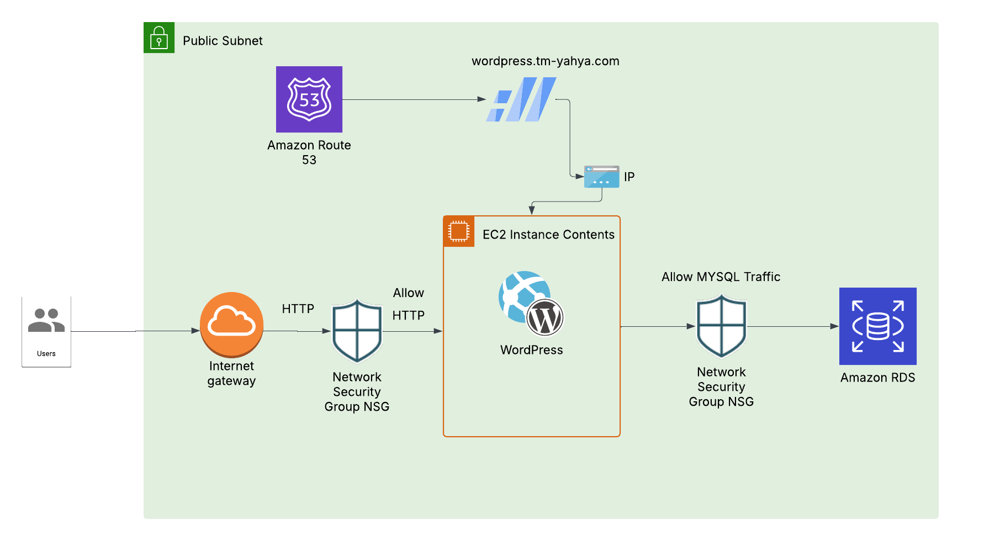

# 🚀 WordPress Deployment on AWS using Terraform

This project deploys a WordPress application on AWS using **Terraform**, with infrastructure built from scratch. It provisions a secure and scalable environment using EC2, RDS, and other AWS resources.

---

## 📦 Stack

- **Terraform**
- **AWS EC2** (Ubuntu 22.04) for hosting WordPress
- **AWS RDS** (MySQL) for the database
- **Apache2** and **PHP 8.1** for the application server
- **User Data Script** for automated instance provisioning

---

## 🏗️ Architecture

## 

## ⚙️ Components Deployed

- VPC with Public Subnet
- Internet Gateway and Route Tables
- Security Groups for EC2 and RDS
- EC2 instance with Ubuntu 22.04
- RDS MySQL instance
- Bootstrap script to install WordPress

---

## 🚀 Getting Started

### ✅ Prerequisites

- [Terraform CLI](https://developer.hashicorp.com/terraform/downloads)
- AWS CLI configured with IAM permissions
- A key pair to SSH into EC2
- Basic knowledge of Terraform and AWS

---

### 🔧 Setup

1. **Clone the repository**

```
git clone https://github.com/yourusername/wordpress-terraform.git
cd wordpress-terraform
```

2. **Configure variables**  
   Create and Edit terraform.tfvars or set these in variables.tf:

```
aws_region = "eu-west-1"
db_name = "wordpress"
db_user = "admin"
db_password = "yourpassword"
key_name = "your-keypair-name"
```

3. **Initialise Terraform**

```
terraform init
```

4. **Preview the plan**

```
terraform plan
```

5.  **Deploy the infrastructure**

```
terraform apply -auto-approve
```

## 🌐 Accessing WordPress

After deployment, Terraform will output the public IP of the EC2 instance. Open it in a browser:

**_http://IP_**

You should see the WordPress installation screen.

## 🔐 Security Notes
Allow only port 80 (HTTP) to the world

Restrict SSH (port 22) to your own IP

Use Secrets Manager or SSM Parameter Store to manage DB credentials in production

## 🧹 Cleanup

6. **To delete all resources:**

```
terraform destroy
```
